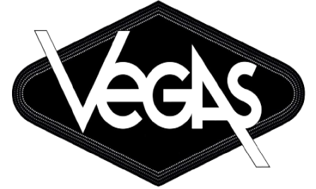

# Vegas: Personalized Watch Store

Welcome to **Vegas**, a unique watch store dedicated to offering personalized timepieces that match your individual style and preferences. At Vegas, we believe that a watch is more than just a tool for telling time; it's a reflection of your personality and taste. Our store combines cutting-edge technology with expert craftsmanship to provide a seamless and personalized shopping experience. By leveraging detailed customer profiles and preferences, we curate a selection of watches tailored specifically for you, ensuring that every piece you choose is a perfect fit. Whether you're looking for a classic, elegant timepiece or a modern, Vegas is committed to helping you find the watch that best suits your lifestyle. Join us at Vegas and discover the watch that tells your story.

# Tech Stack
The MERN Stack was used for this project.

  
  
  
  
  
  

Vegas was designed using Figma for UI/UX design, and developed using javascript,HTML and CSS. Firebase from Google was used for backend services. 

<h2>How to run the Project</h2>

<h2>Features of Vegas</h2>

<h2>Customer Interface</h2>

<h2>Shop Manager Interface</h2>

<h2>Used By</h2>

This project was created as part of the requirements for completing a bachelor's degree in software engineering at Azrieli College of Engineering in Jerusalem.

<h2>Author</h2>

Author: <a href="https://github.com/Elo2000">https://github.com/Elo2000</a>

